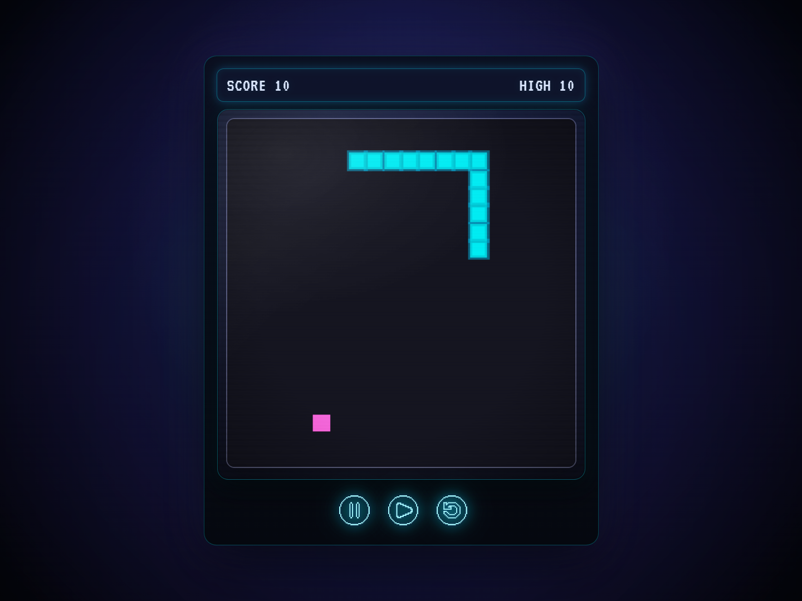

# 🐍 Snake Game

A browser-based Snake game reimagined with a retro-futuristic / Tron-inspired arcade UI.  
This project started as an exploration of visual design in games: how color, lighting, and UI hierarchy can transform a simple concept into something that feels polished and intentional. The gameplay stays true to the original, no gimmicks, just you vs. the snake, while the presentation aims for that "one more game" arcade appeal.

## 🎮 Play the Game Live! ----> https://dinuga-tw.github.io/snake-game/

## 🎯 How to Play

- Use **Arrow Keys** to control the snake's direction
- Eat the food to grow and increase your score
- Avoid hitting the walls or yourself
- Click **Pause** to take a breather
- Hit **Restart** to go again (and beat that high score!)

## ✨ Features

- Retro 80s arcade cabinet design with CRT monitor effects
- Pixelated rendering for authentic retro look
- Neon cyan/blue color scheme with glowing effects
- Pause/resume functionality
- High score tracking (session-based)
- Responsive controls
- Game over detection with restart option

## 🛠️ Technologies Used

- **HTML5 Canvas** - Game rendering and graphics
- **Vanilla JavaScript** - Game logic and mechanics
- **CSS3** - Retro UI styling with advanced effects

## 🎨 Design Highlights

- Off-screen canvas rendering for crisp pixel scaling
- Authentic CRT scanline overlay
- Multi-layer CSS shadows for depth and neon glow
- Radial gradient background halo effect
- Glass surface reflection on game board frame
- Carefully tuned color palette for visual cohesion

## 📸 Screenshots

## 📝 Future Improvements

- Add sound effects and background music
- Implement difficulty levels
- Add mobile touch controls
- Leaderboard system

## 👨‍💻 Author

**Dinuga-TW**

---
